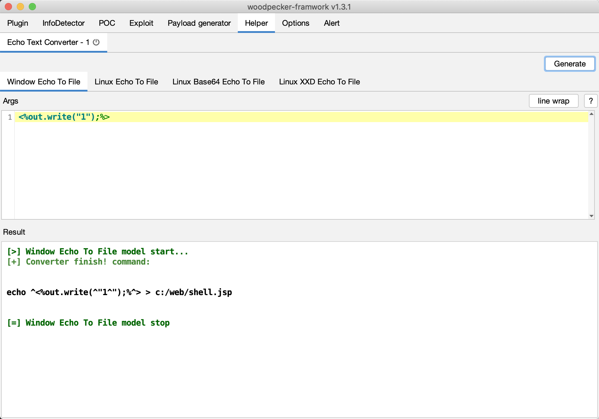
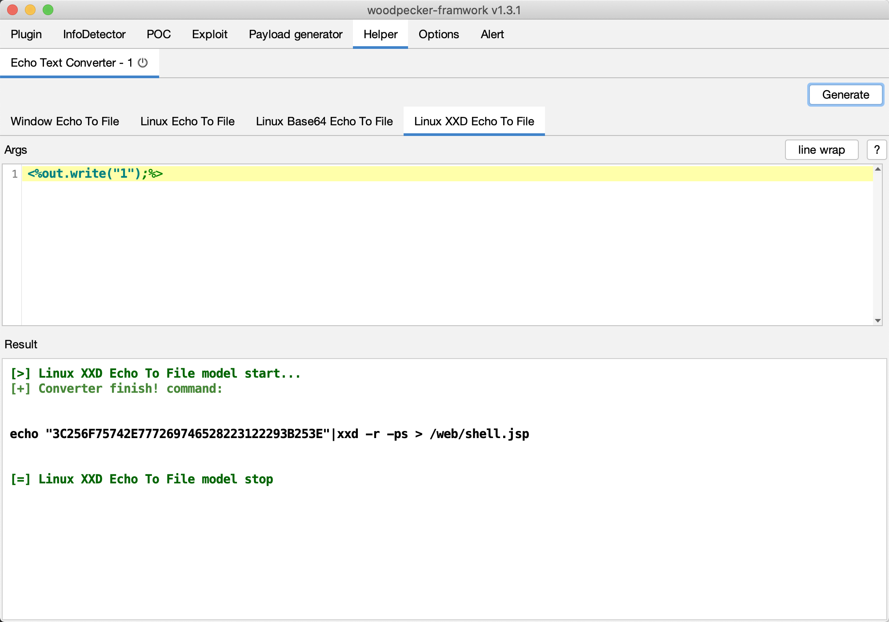

# EchoTextConverter

## 0x01 简介

`EchoTextConverter`是woodpecker框架命令写文件插件，通常用在命令执行漏洞写文件webshell场景。目前支持一下4中方式写文件。

* windows
    - [x] ^转义方式写文件
* linux
    - [x] \转义方式写文件
    - [x] base64方式写文件
    - [x] xxd方式写文件
    
## 0x02 截图

